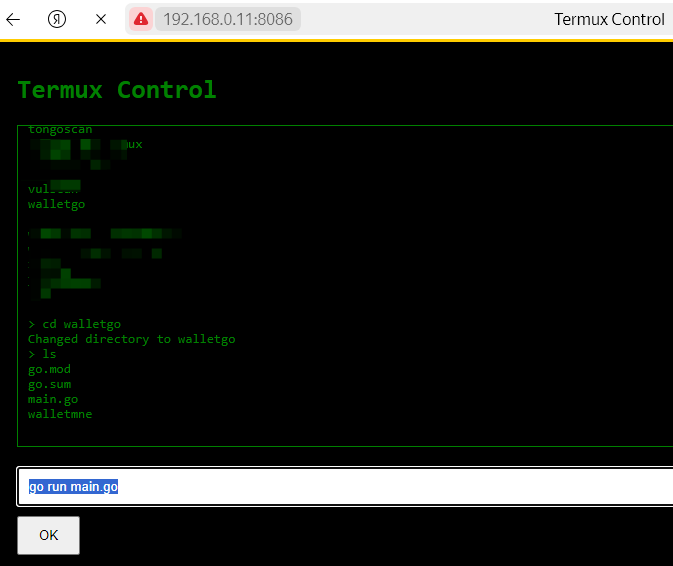

# Local-Termux
Local management of Termux

Управляйте Termux с помощью командой строки через локальную сеть в браузере
запустить: python server.py

введите порт (например 8080)
сервер запущен в локальной сети.
выдаст ссылку (например http://192.168.0.11:8080)
перейдите на неё с ПК подключенного к одной сети.
консоль в браузере запущена.
